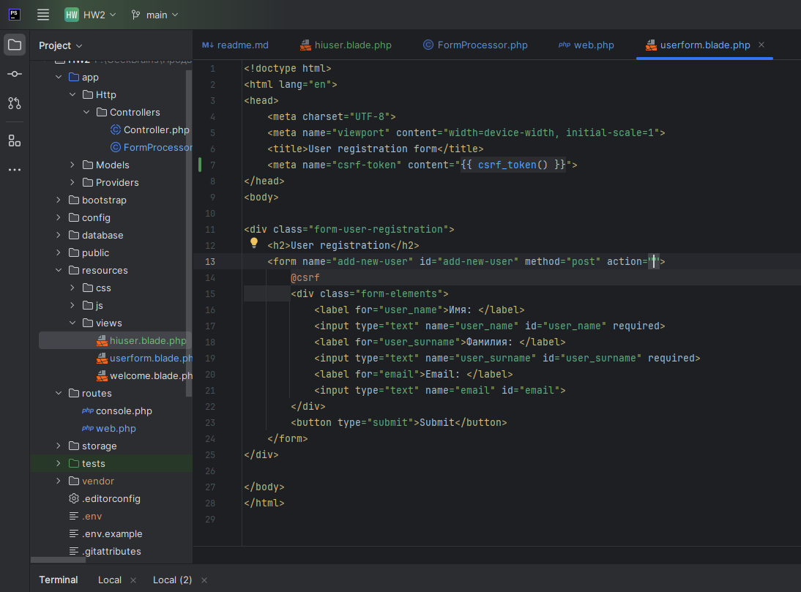
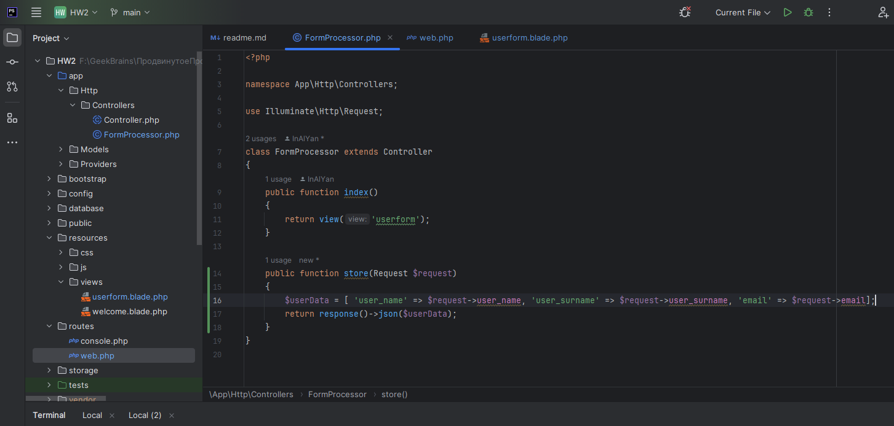
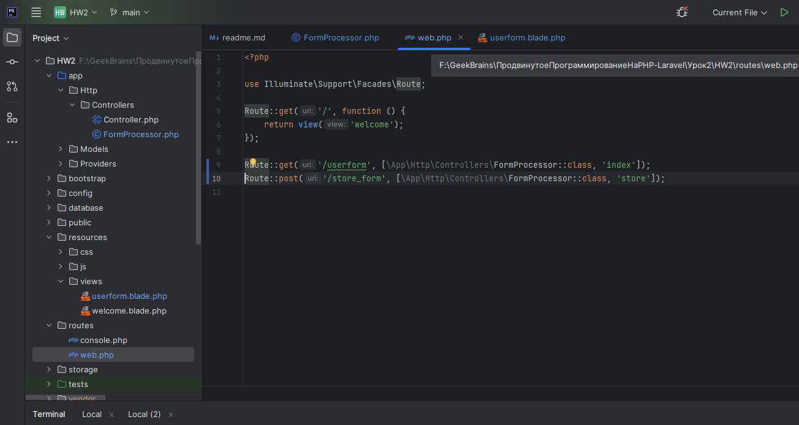
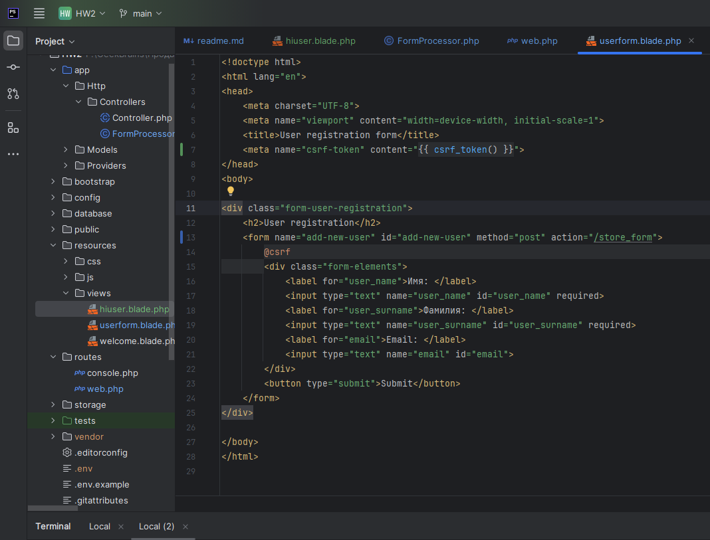
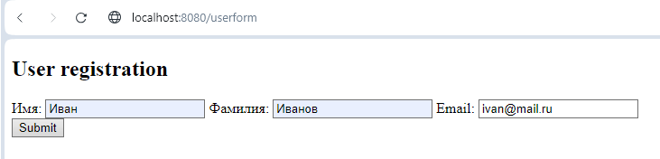
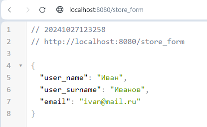
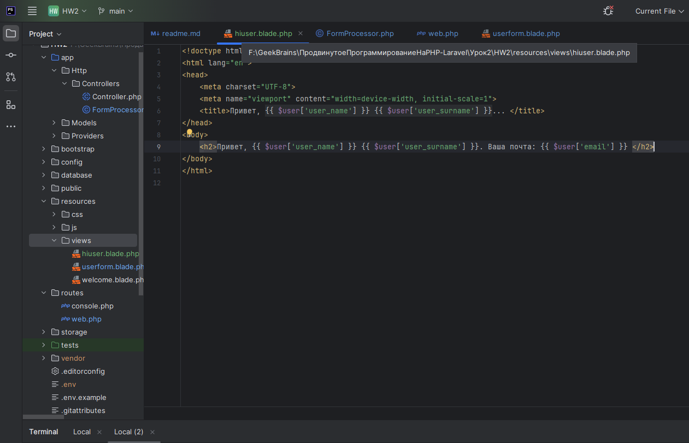
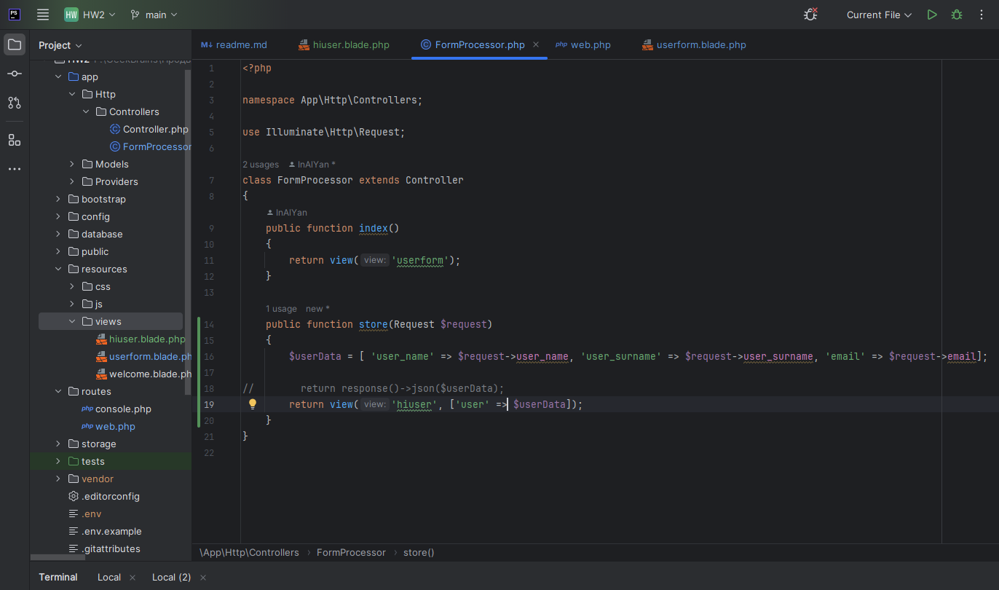
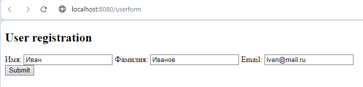
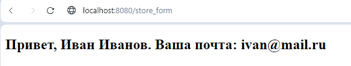

# Продвинутое программирование на PHP — Laravel
## Домашняя работа №2

---
### 1. Установите Laravel с помощью composer, выполнив команду composer create-project laravel/laravel <имя проекта>. В поле <имя проекта> впишите имя вашего проекта. Этому имени будет соответствовать имя папки, в которую вы поместите проект.

---

---
### 2. Создайте контроллер для вывода формы на страницу и её обработки. В командную строку введите команду php artisan make:controller FormProcessor.

---

----
### 3. После выполнения команды убедитесь, что контроллер создан, — соответствующий файл должен появиться в папке app/Http/Controllers.

---

----
### 4. Внутри контроллера опишите метод index: он должен выводить в браузер форму для заполнения.

---

---

- Опишите форму в виде шаблона blade.
- Внутри формы должны быть поля для ввода имени, фамилии и email пользователя.
- Форма отправляется методом POST.
- Параметр action пока оставьте пустым.
- Не забудьте про CSRF.

---

---
### 5. Внутри файла /routes/web.php опишите новый роут (метод GET), который будет вызывать метод index контроллера FormProcessor по url /userform.

---

---
### 6. Запустите встроенный сервер Laravel командой php artisan serve --port=8080 и убедитесь, что форма выводится по адресу http://localhost:8080/userform.

---

---
### 7. В контроллере FormProcessor создайте метод store для обработки формы. Этот метод должен принимать поля формы и отправлять ответ в виде JSON-объекта, содержащего значения полей формы (имя, фамилия, email).

---

---
### 8. Внутри файла /routes/web.php опишите новый роут (метод POST), который будет вызывать метод store контроллера FormProcessor по url /store_form.

---

---
### 9. Отредактируйте поле action формы в шаблоне и укажите адрес /store_form.

---

---

### 10. Откройте форму в браузере по адресу http://localhost:8080/userform, заполните её и попробуйте отправить на сервер, нажав кнопку Submit. Если всё сделано правильно, вы увидите в браузере объект JSON.

---

---

### 11. Создайте новый шаблон blade для приветствия пользователя (например: «Привет, <имя>!»).

---

---

### 12. Измените метод store контроллера FormProcessor таким образом, чтобы вместо JSON он возвращал шаблон, заполненный данными пользователя.

---

---

### 13. Сделайте коммит своих изменений с помощью git и отправьте push в репозиторий.
